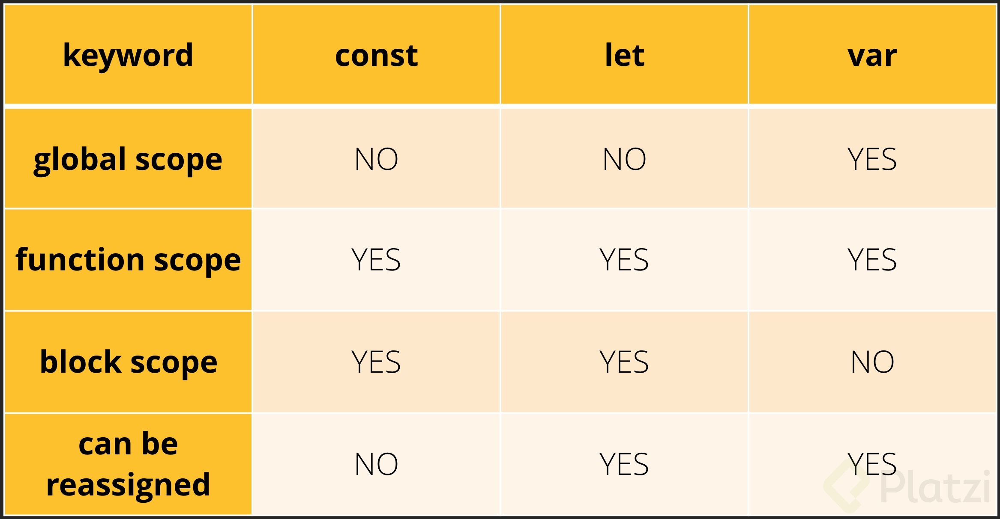
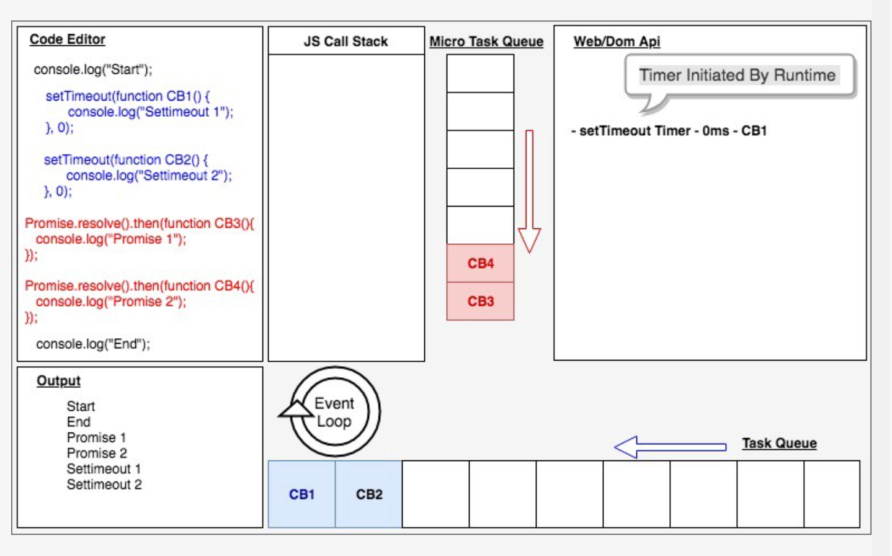

# 📹 video 1 - ¿Qué es ECMAScript? 

🗒️ ECMAScript es la especificación del lenguaje JavaScript propuesto por ECMA Internacional, que es la institución encargada de los estándares, y JavaScript, es el lenguaje de programación que utiliza las especificaciones propuestas, que van siendo añadidas cada año a partir del 2015, cuando fue lanzado ES6.
ECMA es una institución que dicta estándares o funcionalidades que deben adaptarse o añadirse a los engines de Js. Puesto que Js es un lenguaje interpretado y con muchos motores que lo interpretan/compilan, se vió la necesidad de hacer un estándar que todos esos motores siguieran, para tener consistencia en nuestros desarrollo a lo largo de todos los navegadores.

Esto nos ha permitido no solo tener funcionalidades nuevas, si no también que funcione de la misma manera en donde sea que corramos nuestro proyecto. Aunque también es importante decir, que por ser un estándar y no una empresa que está detrás del desarrollo del motor de js en sí, se suele tardar meses incluso años en ver reflejadas las nuevas características en los motores, o ver que esas características llegan primero a uno y luego a otros. Como el caso de Node.js, que incluso 5 años después de ECMAScript 2015 (ES6), aún no podemos usar ECMA import/export en él de manera normal.

# 📹 video 2 - Default Params y Concatenación

+ Primero vamos a trabajar como se hacía antes de ES6
```
    function newFunction(name, age, country){
        var name = name || 'Andres';
        var age = age || '28';
        var country = country || 'BR';
        console.log(name, age, country)
    }

    newFunction();
    newFunction('Roberto', 25, 'EEUU');

```

 ❤️ Ahora, con ES6 se realiza así 👀

```
function newFunction2(name='Oscar', age = 33, country='CO'){
    console.log(name, age, country);
}

newFunction2();
newFunction2('Sara', age=26, 'ES');
```

Ahora veremos concatenación antes de ES6

```
let hello = "Hello";
let world = "World";
let epicPhrase = hello + ' ' + world; 
console.log(epicPhrase);
```

❤️ Ahora veremos que los templates se hace más fácil concatenar, es
necesario ubicar en nuestros teclados las comillas invertidas. 👀

```
let epicPhrase2 = `${hello} ${world}`; 👀
console.log(epicPhrase2);
```

Nota: tener en cuenta que cuando escribo ${} estoy trayendo el valor de dicha variable, pero esto
funciona cuando usas **comillas francesas. ❤️

❤️ Para añadir algo mas a esta clase, tambien le podemos asignar un default param a los elementos dentro de un objeto al momento en que estamos haciendo destructuring. 👀

```
    const obj = { name:'pepe', lastName: undefined } 👀
    const { name, lastname = "perez" } = obj; 👀
    console.log(name, lastname)
    // console output -> pepe perez

```

👌 Esto es de bastante ayuda en momentos en los que tenemos un funcion que recibe muchos parametros, para evitar confundirnos en la posicion de algun parametro **podemos simplemente recibir un solo parametro en la funcion y que este sea un objeto, luego hacemos destructuring para poder obtener sus elementos de manera mas facil.** 👌

Funcion recibiendo todos los parametros  sin un objeto

```
    function saveUser( name, lastName, age, country, city, postalCode, userName, password ){
        //...
    }
```
Al recibir todos los parametros de esta forma podemos equivocarnos al momento de invocar esta funcion. Intercambiamos el parametro Country por el parametro City accidentalmente.

```
    saveUser('pepe', 'perez', 20, 'Toronto', 'Canada', 0000,  'peperez', '123pass' ) 
```

❤️ Funcion recibiendo solo 1 objeto como parametro 👀

```
    function saveUser({ name, lastName, age, country, city, postalCode = 0000, userName, password }){
        //...
    }
    saveUser({ name: 'pepe', lastName: "perez", age: 20, city: 'Toronto', country: 'Canada', userName: 'peperez', password:'123pass' })

```
Aqui intercambiamos la posicion de country y city nuevamente, pero esta vez no importa ya que todo se esta pasando dentro de un objeto, adicionalmente no estamos enviando el elemento postalCode pero su valor por defecto es 0000


# 📹 Video 3 - LET y CONST, Multilínea, Spread Operator y Desestructuración



Antes de ES6 pasaba esto:
```
    let elsa = "elsa ejemplo ssssssssssssssssssssssssssssssss \n"
                + "abasklmnksnknnrfgnmngkldfklklfgnklfnklnfg.";
    console.log(elsa);
```

❤️ Esto funcionaba, sin embargo, no es una opcion muy óptima que digamos. Ahora usamos ES6: comillas francesas 👀


```
    let elsa2 = `Elsa2 Ejemplo: ssssssssssssssssssssssssssssssss
    abasklmnksnknnrfgnmngkldfklklfgnklfnklnfg.`;
    console.log(elsa2);
```

🗒️Nota 1: Note que si bien el uso (;) no es necesario, en este caso, lo usamos porque hace parte de las buenas prácticas de programacion para que los demás vean el código lo más legible posible.

Ahora crearemos un objeto:
```
let person = {
    'name' : 'Jeff',
    'age' : 24,
    'country' : 'ES'
}
```

Del curso de fundamentos de JS, sabemos usar la notacion person.name,
llamaremos al atributo correspondiente a la key name del objeto person.
```
    console.log(person.name, person.age);
```

❤️ **Ahora desestructuraremos nuestro objeto:** 👀
```
    let {name, age, country} = person;
    console.log( name, age, country);
```

Con la anterior linea lo que hicimos fue desestructurar nuestro objeto, esta notación es usper util porque podemos elegir cuales keys necesitamos del mismo objeto y ya puedo proceder a desplegarlas en la consola sin necesidad de utilizar (objeto.key) 

**Ahora vamos a trabajar con array:**

```
    let team1 = ['Oscar', 'Julian', 'Ricardo'];
    let team2 = ['Valeria', 'Yessica', 'Camila'];
    let education = ['David', ...team1, team2];
    console.log(education);
```

❤️ Ahora, queremos un array que contenga a team1 y team2. Pero además de esto, usaremos el (...), esto nos permite traer un array completo. 👀

```
    let education = ['David', ...team1, team2]; 👀💣
    console.log(education);
```

/*Orginalmente se usaba (var) para asignar variables 👀💣
Podemos ver que usamos mucho (let), pero ¿por qué? Bueno (let) se
usa para el scope, es decir, se define para el bloqueu de código en el cual se va a usar.*/

```
    {
        var global = "Global var";
    }

    {
        let globalLet = "Global Let"
        console.log(globalLet);
    }
    console.log(global);
    console.log(globalLet);

```

**¿Por qué no usar VAR?**  👀💣
🗒️ Es un lenguaje debilmente tipado, es decir, cuando definimos una varibale con (var), podemos cambiar su valor en el transcurso del código y con esto podríamos ocasionar distintos bugs y errores en nuestro programa. Por dicho motivo es mejor usar Let y const */

❤️❤️ A diferencia de (let), const no se puede modificar como si lo hacia VAR. 👀💣
```
    const a = 'b';
    a = 'c';
    console.log(a); //error

```

# 📹 Video 4 - Arrow Functions, Promesas y Parámetros en objetos

Antes para crear un objeto en ECMAS 5:

```
    let name = 'Oscar';
    let age = 32;

    obj = {name : name , age : age};
    console.log(obj);
```
❤️❤️ En ECMAScript 6+ ❤️❤️

```
    obj2 = {name, age} 👀💣
    console.log(obj2);
```

## Funciones - ¿Qué son las arrow function?


🗒️ Las funciones de flecha, o arrow functions son una nueva forma de definir funciones y hay distintas variantes en la sintaxis:Función de un solo parámetro.Al crear una arrow function de un solo parámetro no es necesario escribír los paréntesis, tampoco es necesario escribír las llaves, esto se puede cuando la función es de una sola línea y devuelve un valor.

``` 
    const names = [
        {
            name: 'Andres',
            age : 32
        },
        {
            name : 'Oscar',
            age : 27
        }
    ]
```
Las funciones de flecha, o arrow functions son una nueva forma de definir funciones y hay distintas variantes en la sintaxis:

+ **version 1:** Como se hacía en ES 5 

```
    let listOfNames = names.map(function (item){
        console.log(item.name);
    })
```
+ **version 2:** Arrow Function ES6+ 👀💣❤️
```
    let listOfNames2 = names.map(item => console.log(item.name));
```
+ **version 3:** Arrow Fucntion ES6+ 👀💣❤️
```
    const listOfNames3 = (name, age, country) => {
        console.log(name, age, country);
} 
```
+ **version 3:** Arrow Function con un solo parametro ES6+ 👀💣❤️
```
    const listfNames4 = name => {
        console.log(name);
    }
```
+ **version 4:** nos retorna la multiplicacion del numero que le pasamos por parametro. 👀💣❤️
```
    const square = num => num * num;
```

## Promesas ❤️

Una Promise (promesa en castellano) es un objeto que representa la terminación o el fracaso de una operación asíncrona. Dado que la mayoría de las personas consumen promises ya creadas, esta guía explicará primero cómo consumirlas, y luego cómo crearlas.

Esencialmente, una promesa es un objeto devuelto al cuál se adjuntan funciones callback, en lugar de pasar callbacks a una función.

**Garantías**

A diferencia de las funciones callback pasadas al "viejo estilo", una promesa viene con algunas garantías: 👀
   + Las funciones callback nunca serán llamadas antes de la terminación de la ejecución actual del bucle de eventos de JavaScript.
   + Las funciones callback añadidas con then() incluso después del éxito o fracaso de la operación asíncrona serán llamadas como se mostró anteriormente.
   + Múltiples funciones callback pueden ser añadidas llamando a then() varias veces. Cada una de ellas es ejecutada una seguida de la otra, en el orden en el que fueron insertadas.

```
    const helloPromise = () =>{
        return new Promise((resolve, reject) =>{
            if(true){
                resolve('Todo ok!');
            }else{
                reject('Ups!! Error')
            }
        });
    }

    helloPromise()
        .then(response => console.log(response))
        .then(() => console.log('Hola'))
        .catch(error => console.log(error));
```

# 📹 Video 5 -  Clases, Módulos (Import) y Generadores

## Clases:  👀❤️

```
class calculator{
    constructor(){
        this.valueA = 0;
        this.valueB = 0
    }
    sum(valueA, valueB){
        this.valueA = valueA;
        this.valueB = valueB;
        return this.valueA + this.valueB;
    }
}

const calc = new calculator();
console.log(calc.sum(2, 2));
```

##  Modulos: 👀❤️

+ **Importaciones nombradas:**  👀
    +  Puedes importar uno o más objetos o valores utilizando el nombre que se le definió en el módulo y que se haya declarado con la palabra clave export. Ejemplo:

```
// module.js
export const myExport = "hola"

// index.js
import { myExport } from "module.js"
```

+ **Importación predeterminada (default)** 👀
    + Cuando el módulo tiene una exportación predeterminada (default) omitimos el uso de llaves al momento de importar. Ejemplo:
   
    ```
    // module.js
    function myFunction() {...}

    export default myFunction

    // index.js
    import myFunction from "module.js"

    ```
+ **Para importar los dos tipos de exportaciones podemos separarlos por comas. Ejemplo:**
```
    // module.js
    export const myExport = "hola"
    function myFunction() {}

    export default myFunction

    // index.js
    import myFunction, { myExport }
```

## Generadores 👀❤️

+ El objeto Generator es retornado por una función generator y es conformado tanto el protocolo iterable como el protocolo iterador.
+  Este objeto no puede ser instanciado directamente. En su lugar, una instancia del objeto Generator puede ser devuelta por una función generator:

```
function* gen() {
	  yield 1;
	  yield 2;
	  yield 3;
	}

	var g = gen(); // "Generator { }"

``` 

+ **Un iterador infinito**
```
    function* idMaker() {
	    var index = 0;
	    while(true)
	        yield index++;
	}

	var gen = idMaker(); // "Generator { }"

	console.log(gen.next().value); // 0
	console.log(gen.next().value); // 1
	console.log(gen.next().value); // 2

```
+ Ejemplo: un algoritmo de fibonacci

# 📹 Video 6 - ¿Qué se implementó en ES7?

🗒️ La actual versión de ECMAScript es la número 7 (aunque sea la 6ª que sale realmente). El problema es que cuando en la Web buscas información sobre ES7 o ECMAScript 7 realmente de lo que están hablando no es de esta versión.

Se suponía que para esta última versión que acaba de salir se iban a incluir muchas nuevas funcionalidades en el lenguaje. Sin embargo no dio tiempo material y se ha lanzado una actualización muy descafeinada, con solo un par de cositas. La verdadera versión "grande" con enormes cambios fue la del año pasado, ES6 o ES2015. La más reciente, ES2016, es una actualización muy floja.

Así que cuando en Internet leas algo sobre ES7 en realidad están hablando de algo que no existe todavía y que de momento no se sabe cuándo va a estar disponible. Es posible que muchas de las nuevas características estén ya en ECMAScript 2017 (que sería realmente ES8), pero puede que tarden mucho más y sea finalmente en 2019 o 2020 cuando veamos algunas de ellas. Así que mucho cuidado con lo que te digan sobre ES7: probablemente no estén hablando de lo que tú crees.

+ **Cambios:**
    + **includes:** 👀💣❤️
```
    let numbers = [1, 2, 3, 7, 8];

    if(numbers.includes(7)){
         console.log('Si se encuentra el valor 7');
    }else{
         console.log('No se encuentra.')
    }

    let numbers = [1, 2, 3, 7, 8];
    const VALUE = 7;

    if (numbers.includes(VALUE)) {
        console.log(`Sí se encuentra el valor ${VALUE}`);
    } else {
        console.log(`No se encuentra el valor ${VALUE}`);
    }
```

   + **Potencia (Pow):** 👀💣❤️
   ```
    let base = 4;
    let exponent = 4;
    let result = base ** exponent;
    console.log(`Result -> ${result}`);

   ```


# 📹 Video 7 - ¿Qué se implementó en ES8?

+ En este video veremos algunas implementaciones de ES8:
    + **Object entries,** 
    + **Object Values,** 
    + **Padding y** 
    + **Trailing-Comas.**

En el siguiente código se lista los ejemplos comentariados.

+ **Object entries:** devuelve los valores de una matriz: 👀💣❤️
```
    const data ={
        fronted : 'Oscar',
        backend : 'Isabel',
        design: 'Ana',
    };

```

Tranformar este objeto en una matriz: 
```
    const entries =Object.entries(data);
    console.log(entries);
```

Salida:
```
[
  [ 'fronted', 'Oscar' ],
  [ 'backend', 'Isabel' ],
  [ 'design', 'Ana' ]
]
```

Si queremos saber cuantos elementos posee nuestro arreglo ahora es posible con length:
```
console.log(entries.length); //3
```


+ **Objetc Values:** Me devuelve los valores de un objeto a un arreglo. ❤️
```
    const data= {
        fronted : 'Oscar',
        backend : 'Isabel',
        design: 'Ana',
    }


const values = Object.values(data);
console.log(values);

```
Salida:
```
    [ 'Oscar', 'Isabel', 'Ana' ]
```

+ **Padding:** nos permite añadir cadenas vacías a string, pudiendo modificar la cadena string como tal.❤️ Podría servir del lado del front , para mostrar una estructura de elementos.

```
    const string ='hello';
    console.log(string.padStart(7,'hi')) // se añade al inicio la palabra 'hi'. 7 es el largo total del string
    console.log(string.padEnd(12,'hi')) // Se añade al final la palabra 'hi'. 12 es el largo total del string.
```

+ **Trailing-Comas**: nos permite asignar elementos al objeto mediante comas.
```
    const data= {
        front:'Alej', // Puede existir
        back: 'Rel'
    }
```

# 📹 Video 8 - Async Await.

Las promesas y async await lógicamente no son iguales. Y te explico el porqué.

¿Alguna vez te has preguntado el por qué existe async await si ya se tiene las promesas? Muchos desarrolladores ya están usando esta funcionalidad. Sin embargo, no saben cómo funciona o cómo es diferente de las promesas. Eso es exactamente lo que abarcará este post. Empezaremos recordando por qué llegaron las promesas y cómo es que funciona, luego será el turno de async await y su funcionamiento. Finalmente veremos un ejemplo de cómo aplicar estas dos formas de manejar la asíncronia en conjunto.

+ ¿Por qué Promesas?
+ La llegada de Async Await
+ Async Await y Promesas trabajando juntos.

Para poder entender varios términos que se va a usar, es necesario tener cierto conocimiento previo de Javascript y su asíncronia. Por eso, te recomiendo leer estos posts. Son muy buenos!

+ Qué son y cómo funcionan las promesas en JavaScript: 🔦
    + https://platzi.com/blog/que-es-y-como-funcionan-las-promesas-en-javascript/
+ Mezclando flujos síncronos y asíncronos usando promesas en JavaScript:  🔦
    + https://platzi.com/blog/mezclando-flujos-sincronos-y-asincronos/

Ya tenemos todo lo necesario y ya estás listo para seguir leyendo este post. Esta es una oportunidad de entender mejor la asíncronia en Javascript. A por ello!

##  ¿Por qué Promesas?  🔦

Las promesas llegan en ECMAscript 2016 como solución a uno de los problemas que generaba los callbacks, el callback hell. Este hacía que el código asíncronico se apile horizontalmente a la derecha. Por lo cual esto hacía que el código se vuelva muy complicado de leer. Lo que planteaba las promesas era una mejor sintaxis. En vez de que el código esté horizonal, pues que esté vertical y encadenado. Veamos un ejemplo para entenderlo mejor.

En estos trozos de código hacemos unas llamadas a un api para conseguir el id de un usuario, conseguir sus seguidores y haces más cosas. Haciendo esto con tan solo callbacks, nos resulta como en la imagen. Imagínate que haya muchos más callbacks. ¿Difícil de leer, no?

```

    callEndpoint('api/getidbyusername/davos', function (results) {
            callEndpoint('api/getfollowersbyid' + results.userId, function (results) {
                callEndpoint('api/someothercall', function (results) {
                    callEndpoint('api/someothercall', function (results) {
                        callEndpoint('api/someothercall', function (results) {
                            callEndpoint('api/someothercall', function (results) {
                            // do things here
                            })
                        })
                    })
                })
            })
        })

```

Pero con las promesas todo es diferente, el código se vuelve vertical y más legible.

```
callEndpoint('api/getidbyusername/davos')
    	.then(results => callEndpoint('api/getfollowersbyid' + results.userId))
    	.then(results => callEndpoint('api/someothercall'))
    	.then(results => callEndpoint('api/someothercall'))
    	.then(results => callEndpoint('api/someothercall'))
    	.then(results => callEndpoint('api/someothercall'))

```

Entonces, ¿Las promesas es solo sintaxis y funcionan igual que los callbacks?

No exactamente. Es cierto que las promesas manejan código que será ejecutado en algún futuro al igual que los callbacks. Nótese aquí la incertidumbre de cuándo será ejecutado este código. Sin embargo, la diferencia está en el mecanismo de las promesas. Pero antes, repasemos un poco para entender este mecanismo. El código síncrono inmediatamente se va a un lugar llamado el Call Stack, aquí la última función que entra al stack es el primero que se ejecuta y que sale del stack así hasta la primera que ingreso. Por otro lado, el asíncrono se va a una cola de tareas para su respectiva ejecución. Una vez que el Call Stack esté vacío, el Event Loop moverá las funciones que ya estén listas de la cola de tareas al Call Stack y luego pasarán a mostrar su resultado. Con esto en mente retomemos las promesas. Estas se dirigen a una cola de tareas diferente a las que van los callbacks. Los callbacks se van al Task Queue y las promesas al PromiseJobs o también llamado MicroTask Queue. Estos son manejadores de tareas, básicamente son los que deciden qué funciones son las que entran y las que salen.

;

## La llegada de Async Await

En ECMAscript 2017 es cuando Async Await entra al juego. Este nuevo feature de Javascript planteaba un mejor manejo de las promesas. Estos ya no estarían encadenados uno del otro volviendo la sintaxis más entendible y fácil de usar. Sobre todo fácil de usar. Para usarlo tan solo se necesita async functions y la keyword await. Este keyword permite que una promesa se resuelva y retorne su valor, esto permite que podamos guardarlo en variables. Pero no todo podía ser oro. await solo funciona en async functions. Este tipo de funciones simplemente se aseguran que lo que sea que retornen sea una promesa. Dicho de otro modo, estas funciones siempre retornan una promesa. Veámoslo en un ejemplo.

Tomaremos el ejemplo de las promesas y convertiremos su sintaxis usando async await:

```
// usando Promesas
    callEndpoint('api/getidbyusername/davos')
    	.then(results => callEndpoint('api/getfollowersbyid' + results.userId))
    	.then(results => callEndpoint('api/someothercall'))
    	.then(results => callEndpoint('api/someothercall'))
    	.then(results => callEndpoint('api/someothercall'))
    	.then(results => callEndpoint('api/someothercall'))
    
    // usando Async Await
    async function callEndpoints() {
    	const userResults = await callEndpoint('api/getidbyusername/davos')
    	const followersResults = await callEndpoint('api/getfollowersbyid' + userResults.userId)
    	const someResults = await callEndpoint('api/someothercall')
    	const moreResults = await callEndpoint('api/someothercall')
    	const anotherResults = await callEndpoint('api/someothercall')
    	const finalResults = await callEndpoint('api/someothercall')
    
    	return finalResults
    }

    callEndpoints()

```

Después de ver la sintaxis creo que estamos de acuerdo que es mucho más simple y entendible de usar. Sin embargo, el manejo de async await es diferente a la de las promesas. Sabemos que await hace una pausa hasta que la promesa se resuelva. Literalmente, hace que la ejecución del async function espere hasta que la promesa se resuelva y retorne un valor, aúnque esto no detiene el engine del lenguaje, este aún puede ejecutar otros scripts o eventos, esto significa que está volviendo el código asíncrono en síncrono. Y tal vez habrás pensado en qué sentido tiene esto si ya no va a ser asíncrono o no sea de utilidad y que mejor sigues trabajando con las promesas. Pues, esto no es totalmente cierto. Async Await puede brillar en ciertos casos de uso donde necesitemos esperar y saber cuándo alguna función asíncrona se ejecute, por ejemplo en el caso de pedidos a una api, donde necesitemos que primero la página se llene de datos para que el usuario pueda interactuar.

Pero, y si te dijera que podemos ir aún más allá y combinar lo mejor de ambos mundos. Podemos aprovechar la pausa de async await y las utilidades de las promesas como Promise.all . Esto lo veremos en el siguiente tema en un caso de uso donde sean necesario tener ambas.

## Async Await y Promesas trabajando juntos

Vamos a suponer que estamos programando una carga inicial del perfil de usuario y que uno de los requerimientos sea que debamos mostrar la información básica del usuario, los cursos que ha tomado en la plataforma y la lista de sus amigos antes de que termine la carga. Estos recursos se consiguen por medio de una api, y cada recurso está en una diferente url. Y las url del api de los cursos y la de amigos vienen en la información del usuario en la propiedad links.

Información del usuario: api/user/1234
Cursos que ha tomado: api/user/1234/courses
Lista de sus amigos: api/user/1234/friends
Este es un ejemplo de la respuesta a un pedido a la url de la información del usuario

```
{
    	user: {
    		id: 1234,
    		...
    		links: ['api/user/1234/courses', 'api/user/1234/friends']
    	}
    }

```

Entonces tenemos que hacer 3 pedidos a la api y debemos tener acceso a su data antes de que termine la carga. Está claro lo que debemos usar, async await y promesas.

Vamos a crear una async function donde en primera instancia haremos un pedido a la url del usuario para obtener la información básica y los links que están como propiedad del usuario. Luego, usaremos una utilidad de las promesas, Promise.all. Esto hará que los pedidos se ejecuten paralelamente, por lo tanto el tiempo de espera se disminuye al no tener que ejectuar los pedidos de los links consecutivamente. Un detalle es que si alguno de estos pedidos falla en el Promise.all, todos fallarán. O todo o nada.

Dentro de Promise.all, iteraremos sobre los links con la función de los arreglos, map . Este recibe una función que tiene como argumento el elemento del arreglo en cada iteración, en este caso el link. Luego dentro de la función, aplicamos un arrow function que retorna un fetch al link en cada iteración. Esto hará que en cada iteración se retorne una promesa. Al final, tendremos un arreglo de estas promesas sin resolver. Para esto aplicamos await al Promise.all para que resuelva todas las promesas paralelamente. Una vez ya resueltos, obtendremos todas las respuestas de los pedidos si todo fue bien y lo guardamos en una variable userResponse. Por último aplicamos todo esto de nuevo para parsear las respuestas en data de tipo objeto para que Javascript pueda hacer operaciones sobre la data.

```
async function getAllUserInfo(id) {
    	const user = await fetch('api/user/' + id)
    
    	const userResponse = await Promise.all(user.links.map(link => fetch(link)))
    
    	const userData = await Promise.all(userResponse.map(response => response.json()))
    
    	return userData
    }

```

Por último obtenemos la data requerida para el usuario, y logramos hacer que la información se visualice por el usuario final.

## Conclusión

Para resumir, las promesas y async await resuelven la asincronía de distinta forma. Con las promesas no sabemos cuándo se va a resolver y con async await forzamos una espera en la función. No siempre se va a usar uno, el otro o ambos, por ello lo primero es entender el caso de uso y después empezamos a implementar todo lo que hemos aprendido aquí.

# 📹 Video 9 - ¿Qué se implementó en ES9?

+ **ES9:**
    + **spread**: permite manipular partes de un objeto es decir destructurar o estructura un objeto
    + then/catch/finally: ahora podemos tener un funciona que permita saber cuando terminó una promesa.
    + "/miRegexString/.exec() ": ahora permite obtener los grupos en un arreglo.

```
    const obj ={
        name: 'jeff',
        age: 24,
        country: 'CO',
    };

    let {name, ...all} = obj;

```
+ Aquí desestructuramos el objeto, sacamos el key que nos interesaba que en este caso es name, y para no escribir el resto usamos (...all)
```
    console.log(name, ...all);
    console.log(all);
```

(...) es conocido como el operador de propagación, con este, podemos traer todas las keys con sus respectivos values de objeto, como veremos a continuación.
```
    const obj1 = {
        ...obj,
        height: 1.81,
    }
```

+ Como podemos ver obj1, tiene todos los keys del obj y además agregamos un nuevo key que sería height. 

```
    console.log(obj1);
```

+ **Async/Await:** 👀
```
    const helloWorld = () => {
        return new Promise((resolve, reject) =>{
            (true)
                ? setTimeout(() => resolve('Hello world'), 3000)
                : reject(new Error('Test Error'))
        });
    }
```

+ **Promesas:** 👀
```
    helloWorld()
        .then(response => console.log(response))
        .catch(error => console.log(error))
        .finally(() => console.log('finalizo'))
```

## ¿Cómo mejoró el manejo de Regex? 👀

Esto es super util para trabajar con fechas. Como sabemos, las fechas tienen: año, mes, dia
[0-9] indica el rango de numero
{4} nos indica que se necesitan maximo 4 numeros

```
    const regexData = /([0-9]{4})-([0-9]{2})-([0-9]{2})/
    const match = regexData.exec('2018-04-20');
    const year = match[1];
    const month = match[2];
    const day = match[3];

    console.log(year, month, day);
```    

# 📹 Video 10 - ¿Qué se implementó en ES10?

arreglo:
```
    let array = [1, 2, 3, [1,2,3,[1,2,3]]]
```
+ **flat:** crea una nueva matriz con todos los elementos de sub-array concatenados recursivamente hasta la profundidad especificada. 
```
    console.log(array.flat(2)) //flat(x). (x) podemos ver los diferentes niveles 1,2,3
```

+ **flatMap()**
```
    let array1 = [1,2,3,4,5];
    console.log(array1.flatMap(value => [value, value*2]));
```

+ **trimStart():** permite eliminar los espacios en blanco.
```
    let hello = '                  hello world';
    console.log(hello);
    console.log(hello.trimStart());
```

+ **trimEnd()**: permite eliminar los espacios en blanco.
```
    let hello1 = 'hello world                   ';
    console.log(hello1);
    console.log(hello1.trimEnd);
```

+ **try-catch**
```
    try{

    }catch{
        error
    }
```

+ **fromEntries()**: transformar un arreglo en un objeto
```
    let entries = [["name","Oscar"],["age", 32]];
    console.log(Object.fromEntries(entries)); 
```
+ **description**
```
    let mySimbol = 'My simbol';
    let symbol = Symbol(mySimbol);
    console.log(symbol.description);
```

# 📹 Video 11 - ECMAScript 2020

+ **Dynamic import ( importación dinámica)**
    + Podremos realizar importacion dinamica de piezas de codigo
    + Permite llamar nuestro código cuando lo necesitemos.
    + El archivo no se va a cargar de manera automatica.
    + Con esto podremos dividir nuestro codigo y evitar que la app sea muy grande.
    + Por todo lo anterior, mejora la performance.

Codigo usando durante la clase:
+ Archivo **index.html**
```
    <!DOCTYPE html>
    <html lang="en">
    <head>
        <meta charset="UTF-8">
        <meta http-equiv="X-UA-Compatible" content="IE=edge">
        <meta name="viewport" content="width=device-width, initial-scale=1.0">
        <title>Document</title>
    </head>
    <body>
        <button id="btn">File</button>
        <script type="module" src="./index.js"></script>
    </body>
    </html>

```

+ archivo principal de **index.js**
```
    const button = document.getElementById("btn");

    button.addEventListener("click", async function(){
        const module = await import("./file.js");
        module.hello();
    });
```

+ archivo secundario **file.js** (cargamos en la consola del navegador al pulsar en el boton)
```
    export function hello(){
        console.log("Hola Mundo");
    }
```

# 📹 Video 12 - ECMAScript 2020 - características importantes

+ 👌**Big INT:**  
   + permite trabajar con numeros mayores a 2^53.
   + BigIntes un objeto contenedor primitivo que se usa para representar y manipular valores primitivos , que son demasiado grandes para ser representados por el primitivo .bigintnumber
   + https://developer.mozilla.org/en-US/docs/Web/JavaScript/Reference/Global_Objects/BigInt

+  1- Añadiendo una "n" al final activas el big int en el valor.
```
    const aBigNumber = 9007199254740991n;
```

+ 2- Con el metodo BigInt activas el valor
```
    const anotherBigNumber = BigInt(9007199254740991);

    console.log(aBigNumber);
    console.log(anotherBigNumber);  
```
+ 🤝 **Promise All Settled** 
    + El Promise.allSettled()método devuelve una promesa que se resuelve después de que todas las promesas dadas se hayan cumplido o rechazado, con una matriz de objetos que describen el resultado de cada promesa.
    + https://developer.mozilla.org/en-US/docs/Web/JavaScript/Reference/Global_Objects/Promise/allSettled

```
    const promise1 = new Promise((resolve,reject) => reject("reject"));
    const promise2 = new Promise((resolve,reject) => resolve("resolve"));
    const promise3 = new Promise((resolve,reject) => resolve("resolve 1"));


    Promise.allSettled([promise1, promise2, promise3])
        .then(response => console.log(response));
```
+ 🌎 **Global This** 
    + La **global This** propiedad global contiene el thisvalor global, que es similar al objeto global .
    + https://developer.mozilla.org/en-US/docs/Web/JavaScript/Reference/Operators/Nullish_coalescing_operator

```
    console.log(window);
    console.log(globalThis);
```

+ 🔍 **Nuevo operador lógico: null operator**

    + El operador coalescente nulo ( ??) es un operador lógico que devuelve su operando del lado derecho cuando su operando del lado izquierdo es nullo undefined, y de lo contrario devuelve su operando del lado izquierdo.
    + https://developer.mozilla.org/en-US/docs/Web/JavaScript/Reference/Operators/Nullish_coalescing_operator

```
    const fooo = null ?? 'default string';
    console.log(fooo);

    const fooo2 = 'not null' ?? 'default string';
    console.log(fooo2)
```
+ ⛓ **Optional chaining**
    + El operador de encadenamiento opcional?. ( ) le permite leer el valor de una propiedad ubicada en lo profundo de una cadena de objetos conectados sin tener que verificar que cada referencia en la cadena sea válida.
    + https://developer.mozilla.org/en-US/docs/Web/JavaScript/Reference/Operators/Optional_chaining

```
    const user = {};
    console.log(user?.profile?.email);

    if(user?.profile?.email) {
        console.log('email')
    } else{
        console.log('fail')
    }
```

# Video 13 - ECMAScript 2021

+ 🧯 **Replace**

```
    const string = "JavaScript es maravilloso, con JavaScript puedo crear el futuro de la web.";
    const replacedString = string.replace("JavaScript", "Python");
    console.log(replacedString);
```

Output: Python es maravilloso, con JavaScript puedo crear el futuro de la web.

```
    const replacedString2 = string.replaceAll("JavaScript", "Python");
    console.log(replacedString2);
```

Output: Python es maravilloso, con Python puedo crear el futuro de la web.

+ 🔒 **Metodos privados**

```
    class Message {
        #show(val){ // Con el # convertimos al método en privado
            console.log(val);
        };
    };

    const message = new Message();
    message.show('Hola!');

```

+ 👽 **Promise Any**
    + Captamos la primera respuesta que sea satisfactoria
```
    const promise1 = new Promise((resolve, reject) => reject("1"));
    const promise2 = new Promise((resolve, reject) => resolve("2"));
    const promise3 = new Promise((resolve, reject) => resolve("3"));

    Promise.any([promise1, promise2, promise3])
        .then(response => console.log(response));
```

+ 🦴**WeakRef(element);**
    + Un WeakRefobjeto le permite mantener una referencia débil a otro objeto, sin evitar que ese objeto sea recolectado como basura.

```
    class AnyClass {
        constructor(element){
            this.ref = new WeakRef
        }
        {...}
    }
```

+ 🧪 **Nuevos operadores lógicos**

```
    let isTrue = true;
    let isFalse = false;
    console.log(isTrue &&= isFalse); //Asignación Lógica

    let isTrue1 = true;
    let isFalse1 = false;
    console.log(isTrue1 ||= isFalse1); //Asignación Or lógica

    let isTrue2 = undefined;
    let isFalse2 = false;
    console.log(isTrue2 ??= isFalse2); //Asignacion de anulación lógica
```

ES6 => ES7 => ES8 => ES9 => ES10 A lo largo del curso ♥️
